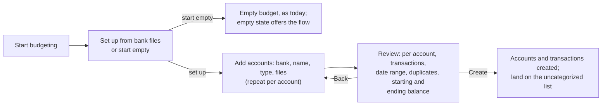

# PRD: Start a budget from bank files

Status: draft for review · 2026-09-27 · local fork only, not for upstream

## Summary

When someone starts a new budget, Actual should offer to set it up from files
downloaded from their banks. For each account they name the bank and the
account and add that account's files. They can add as many accounts, at as many
banks, as they like. Actual shows what it will create before it writes
anything: the accounts, their transactions, and a starting balance that makes
each account's balance match the bank's. One confirmation creates it all.

Today, "Start budgeting" opens a budget page with seven default categories,
no accounts and $0 everywhere. Nothing on it says how to get bank data in.
The one import on the welcome screen, "Import my budget", only reads budget
files from YNAB4, nYNAB and Actual. Bank files go in one account at a time,
from an Import button that exists only inside an account, so someone has to
create an account first without knowing that is the next step. Someone who
does not want to type transactions by hand has no visible way forward.

## How it works today

To get six months of Chase checking history into a new budget, someone has to:

1. Click **Start budgeting** on the welcome screen. The budget page opens with
   the default categories (Food, General, Bills, Bills (Flexible), Savings,
   Income, Starting Balances) and no accounts.
2. Find **+ Add account** in the sidebar, choose **Create a local account**,
   and enter a name and a balance (`CreateLocalAccountModal.tsx`).
3. Open the new account and click **Import** in its header, or press Cmd+I
   (`accounts/Header.tsx:353`). The file picker accepts QIF, OFX, QFX, CSV,
   TSV and CAMT.053 XML (`accounts/Account.tsx:627`).
4. In the import dialog, check the preview, map columns and the date format
   for a CSV, and import.
5. Repeat steps 2 to 4 for every other account.

Step 2 has a trap. The balance entered there is recorded as a Starting Balances
transaction dated today (`createAccount` in
`packages/loot-core/src/server/accounts/app.ts`). Someone who enters their
current balance, as the field invites, and then imports six months of history
ends up with a balance that is off by the net of those six months. The correct
starting balance is the balance on the day before the earliest imported
transaction, which nobody knows offhand.

The pieces the new flow needs mostly exist. `parse-file.ts` in
`packages/loot-core/src/server/transactions/import/` already parses every
format above. The import dialog already maps CSV columns, flips amount signs
and flags duplicates, and `importTransactions` already deduplicates by
`imported_id`, which OFX and QFX fill from each transaction's `FITID`. What is
missing is a way to do this for several accounts at once, before any account
exists, and to work out the starting balance. The OFX parser also throws away
the statement fields that would help: the bank (`FI/ORG`), the account number
and type (`BANKACCTFROM`, `CCACCTFROM`) and the ledger balance with its date
(`LEDGERBAL`).

## Goals and non-goals

Goals:

- A new budget can be set up from bank files without knowing where Actual's
  import lives.
- Several accounts at several banks are set up in one pass.
- Each account's balance matches the bank's on the day the files end, without
  the person working out a starting balance.
- Nothing is written until the person has seen what will be created.
- Skipping the flow leaves today's empty budget exactly as it is.

Non-goals:

- **Bank sync.** No account links, no Plaid, SimpleFIN or GoCardless. The flow
  works only from files the person downloaded.
- **Categorizing the imported history.** Every imported transaction arrives
  uncategorized, as it does today. The flow ends at the uncategorized list,
  where [the merchant category offer](../merchant-category-offer/PRD.md) does
  that work.
- **Budget amounts.** The flow does not assign money to categories.
- **Importing into an existing budget.** The per-account Import button stays
  the way to add files later.
- **PDF statements, in the first version.** See Scope.
- **Mobile.** Desktop and web first.
- **Upstream.** This is for a local fork, so it can change the welcome screen
  and the first-run path without an upstream design discussion.

## Scope

The first version accepts the formats Actual already parses: OFX, QFX, QIF,
CSV, TSV and CAMT.053 XML. That covers Chase, whose website exports CSV, QFX,
QBO and OFX for a chosen date range.

It does not cover Chime. As far as I know, Chime offers only monthly PDF
statements, with no CSV or OFX export (to confirm in the Chime app before
building). PDF parsing is bank-specific: every bank lays out its statement
differently, so it needs a parser per bank. The proposal is to ship the flow
with the existing formats first and add a Chime statement parser behind the
same file drop as a second step. Until then, a Chime account can be added in
the flow with a name and a current balance and no history, which is what
creating a local account does today. Whether Chime belongs in the first
version is a decision for the owner, since it is one of the owner's two banks.

## Users and scenarios

**New budget, one bank, QFX files.** Someone downloads six months of Chase
checking as QFX and starts a budget. They add an account, pick Chase, name it
Chase Checking and drop the file. Actual reads the account number, type and
ledger balance from the file and shows, for example, 212 transactions from March 27 to
September 26 and a starting balance of $1,843.20 on March 26, and after
confirmation the account shows the same $2,410.55 the bank does.

**Two banks, mixed formats.** Chase checking as QFX, a Chase credit card as
CSV, Chime checking with no file. The QFX account needs nothing more. The CSV
has no balance, so the flow asks for the card's current balance and uses it
to work out the starting balance; it may also need the columns mapped. Chime
gets a name and a balance.

**Overlapping downloads.** Someone downloaded March to June and then May to
September for the same account. The transactions in both files appear once.

**Changed their mind.** Someone opens the flow and closes it, or skips it. They
land on today's empty budget, where the empty state offers the flow again.

## Proposed experience

1. After **Start budgeting**, Actual asks how to begin: set up from bank files,
   or start with an empty budget. The empty budget's empty state also offers
   the flow, so skipping it is not final.
2. The person adds an account: the bank (free text with suggestions from the
   files), the account name, the type (checking, savings, credit card, other;
   and on or off budget, as in the local account form today), and one or more
   files. They can add more accounts before going on.
3. When a file names the bank and account, as OFX and QFX do, Actual fills in
   what it can: the bank, a suggested name ending in the last four digits, and
   the type. The person can change all of it.
4. A CSV opens the existing column mapping for that file, inside the flow.
5. Review lists each account with its transaction count, date range, the
   number of duplicates dropped, its starting balance and date, and its ending
   balance. Where no file supplies a balance, the account asks for its current
   balance before it can be created.
6. **Create** makes every account, its starting balance transaction and its
   transactions in one undoable step, then opens the uncategorized list with
   a one-line summary: "Created 3 accounts and 486 transactions."

The layout of these steps is for the UX pass; see
[the UX directions](ux/directions.md).

## Alternatives considered

| Option                                                                             | Finds the import | Several accounts in one pass | Correct starting balance | Cost                                              |
| ---------------------------------------------------------------------------------- | ---------------- | ---------------------------- | ------------------------ | ------------------------------------------------- |
| Do nothing; document the per-account Import                                        | No               | No                           | No                       | None                                              |
| Empty state gets "Import from a file", creating one account and opening the import | Yes              | No                           | Only if added            | Small                                             |
| Welcome screen's "Import my budget" also accepts bank files                        | Partly           | Yes                          | Only if added            | Medium                                            |
| Setup flow after Start budgeting (proposed)                                        | Yes              | Yes                          | Yes                      | Medium                                            |
| Bank sync through SimpleFIN Bridge, which Actual already supports                  | Yes              | Yes                          | Yes                      | None to build; an account link, which is excluded |

The empty-state button is the cheapest real fix and the fallback if the flow
proves too costly: it removes the "where is import" problem for one account.
It leaves the starting balance trap and the one-account-at-a-time repetition.
Routing bank files through "Import my budget" puts them where people already
look, but that screen imports a whole budget from another app, and mixing the
two would make both harder to explain. The setup flow costs the most but is
the only option that fixes all three problems, and it happens once, when the
person is already expecting setup questions.

## Requirements

1. After **Start budgeting** creates a budget, Actual offers two choices: set
   up from bank files, or start with an empty budget. Start empty shows
   today's budget page unchanged.
2. The empty state of a budget with no accounts offers the same flow.
3. The flow collects one or more accounts. Each has a bank, a name, a type,
   an on-budget or off-budget setting, and zero or more files. An account with
   no files is created with the balance the person enters, as today.
4. Files are parsed as they are added, with the existing parsers. A file that
   fails to parse is marked on its account with the parser's error and can be
   removed; it never blocks the other accounts.
5. For OFX and QFX, the parser also returns the bank, account number, account
   type and ledger balance with its date, and the flow pre-fills the account
   from them.
6. For CSV and TSV, the flow uses the existing column mapping, sign options
   and date format, per file.
7. Within one account, transactions that appear in more than one file are
   imported once, using `imported_id` where present and the existing duplicate
   matching otherwise.
8. Each account's starting balance is dated the day before its earliest
   imported transaction and equals the known balance minus the net of the
   transactions up to that balance's date. The known balance comes from the
   OFX ledger balance, or from the person, who is asked for the balance as of
   the last transaction date.
9. Review shows, per account: transaction count, date range, duplicates
   dropped, starting balance and date, and ending balance. Nothing is written
   before **Create**.
10. **Create** writes all accounts and transactions as one undoable change.
    Rules run on the imported transactions, as they do on any import.
11. After **Create**, Actual opens the uncategorized transactions with a
    summary of what was created.
12. Closing the flow before **Create** leaves the budget unchanged.

## Edge cases

- **One OFX file with several accounts.** Chase can put checking and savings
  in one OFX download. The flow splits it into one account per statement
  (`STMTTRNRS`), each pre-filled.
- **The same file added to two accounts.** Warned about, by file content, not
  name.
- **Credit cards.** The balance is a liability, entered and shown as a
  negative. OFX credit card statements already carry the right signs; a CSV
  may need the existing sign flip.
- **Pending transactions.** Chase downloads include only posted transactions,
  so a balance entered from the app may include pending ones. The flow asks
  for the balance "as of" the last transaction date and says why.
- **A ledger balance dated after the last transaction.** Accepted: the
  balance still reconciles, because nothing happened in between.
- **Files that do not overlap in time across accounts.** Allowed; each
  account's starting date is its own.
- **Past months after import.** Nothing is budgeted in the imported months,
  so once transactions are categorized those months show overspending that
  rolls into later months' To Budget. How that looks in the envelope and
  tracking budget types needs checking on a seeded budget before building,
  and may need a line of explanation on the summary.
- **Large files.** Several years of history for several accounts must parse
  and preview without freezing the page; preview rows can be summarized
  instead of rendered.
- **Sync.** Created accounts and transactions sync like any import.

## How we will know it works

- **Regression checks.** The sample data generator gains an option to write
  its generated accounts as OFX, QFX and CSV files instead of a budget zip.
  Tests run those files through the flow and check that each account's balance
  matches the generator's, that duplicates across overlapping files appear
  once, and that closing the flow writes nothing.
- **Real files.** The owner sets up a budget from their own Chase downloads
  and compares every account balance with the bank's.
- **The first-run question.** Whether someone who has never used Actual finds
  the flow and finishes it without help can only come from watching a person
  do it. One or two sessions answer it.

## Open questions

- Is a Chime PDF parser in the first version, or the step after?
- Should the flow offer to set a budget month's amounts from the imported
  spending, or leave budgeting entirely to the person?
- Should the bank field drive anything beyond the account name, such as a
  per-bank CSV column preset (Chase checking, Chase credit card)?
- Where does "set up from bank files" live after setup, if anywhere? Today's
  per-account Import covers later imports.
