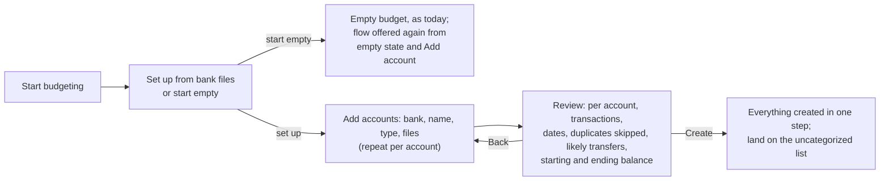

# PRD: Start a budget from bank files

Status: implemented on this branch · 2026-09-28 · [technical design](bank-file-setup-tdd.md) · [UX directions](bank-file-setup-ux.md) · [review record](process/bank-file-setup-reviews.md)

## Summary

When someone starts a new budget, Actual should offer to set it up from files
downloaded from their banks. For each account they name the bank and the
account and add that account's files. They can add as many accounts, at as many
banks, as they like. Actual shows what it will create before it writes
anything: the accounts, their transactions, and a starting balance that makes
each account's history add up to the bank's balance. One confirmation creates
it all.

Today, "Start budgeting" opens a budget page with seven default categories,
no accounts and $0 everywhere. Nothing on it says how to get bank data in.
The one import on the welcome screen, "Import my budget", only reads budget
files from YNAB4, nYNAB and Actual. Bank files go in one account at a time,
from an Import button that exists only inside an account, so someone has to
create an account first without knowing that is the next step. Someone who
does not want to type transactions by hand has no visible way forward.

## How it works today

To get six months of Chase checking history into a new budget, someone has to:

1. Click **Start budgeting** on the welcome screen. The budget page opens with
   the default categories (Food, General, Bills, Bills (Flexible), Savings,
   Income, Starting Balances) and no accounts.
2. Click **+ Add account** in the sidebar. Without a sync server this opens the
   local account form directly; with one, they choose **Create a local
   account** first. They enter a name and a balance.
3. Open the new account and click **Import** in its header, or press Cmd+I
   (`accounts/Header.tsx:353`). The file picker accepts QIF, OFX, QFX, CSV,
   TSV and CAMT.053 XML (`accounts/Account.tsx:627`).
4. In the import dialog, check the preview, map columns and the date format
   for a CSV, and import.
5. Repeat steps 2 to 4 for every other account.

Step 2 has a trap. The balance entered there is recorded as a Starting Balances
transaction dated today (`accounts/app.ts:586`), and nothing in the import path
adjusts it later. Someone who enters their current balance, as the field
invites, and then imports six months of history ends up with a balance that is
off by the net of those six months. Bank sync already avoids this on its first
download: it takes the current balance, subtracts the downloaded transactions,
and dates the result on the oldest transaction (`accounts/sync.ts:1154`). File
import has no equivalent.

The parsing mostly exists. `parse-file.ts` in
`packages/loot-core/src/server/transactions/import/` parses every format
above, the import dialog maps CSV columns and flips signs, and
`importTransactions` skips rows already in the budget, by `imported_id` (which
OFX and QFX fill from each transaction's `FITID`) or by a fuzzy match on the
same amount within 7 days. Three things are missing:

- A way to do this for several accounts at once, before any account exists.
- Deduplication across files. The existing matching compares only against
  saved transactions, so two overlapping files that are not yet written are
  never compared with each other.
- The statement details. The OFX parser throws away the bank (`FI/ORG`), the
  account number and type (`BANKACCTFROM`, `CCACCTFROM`), the statement's
  date range (`BANKTRANLIST/DTSTART`, `DTEND`) and the ledger balance with its
  date (`LEDGERBAL`).

## Goals and non-goals

Goals:

- A new budget can be set up from bank files without knowing where Actual's
  import lives.
- Several accounts at several banks are set up in one pass.
- Each account's starting balance is correct, so its history adds up to the
  bank's balance, without the person working anything out.
- Nothing is written until the person has seen what will be created, and
  nothing is merged or dropped without being shown.
- Skipping the flow leaves today's empty budget exactly as it is.

Non-goals:

- **Bank sync.** No account links, no Plaid, SimpleFIN or GoCardless. The flow
  works only from files the person downloaded.
- **Categorizing the imported history.** Every imported transaction arrives
  uncategorized, as it does today. The flow ends at the uncategorized list,
  where [the merchant category offer](../category-offer/category-offer-prd.md) does
  that work. Transfers between the person's own accounts are the exception;
  see Requirement 10. The owner's separate categorization work may later
  plug into the flow's review step; one input it can use is the Category
  column in Chase credit card CSVs, which import drops today unless each
  value matches an existing category name (`ImportTransactionsModal/utils.ts:152`).
- **Budget amounts.** The flow does not assign money to categories.
- **PDF statements.** Every bank lays out its statement differently, so
  reading them needs a parser per bank. Out of scope.
- **Mobile.** Desktop and web first.
- **Upstream.** This is for a local fork, so it can change the welcome screen
  and the first-run path without an upstream design discussion.

## Scope

The first version accepts the formats Actual already parses (OFX, QFX, QIF,
CSV, TSV, CAMT.053 XML) and adds QBO, which is OFX under another extension.
That covers Chase, whose website exports CSV, QFX, QIF and QBO.

An account with no file, such as one from a bank that offers only PDF
statements, is added in the flow with a name and a current balance and no
history, as a local account is today.

## Users and scenarios

**New budget, one bank, QFX file.** Someone downloads six months of Chase
checking as QFX and starts a budget. They add an account, pick Chase, name it
Chase Checking and drop the file. Actual reads the account number, type,
statement dates and ledger balance from the file and shows, for example, 212
transactions from March 27 to September 26 and a starting balance of
$1,843.20 on March 27. After confirmation the account shows the same $2,410.55
the bank does.

**Mixed formats.** Chase checking as QFX, a Chase credit card as CSV, and a
savings account with no file. The QFX account needs nothing more. The card
CSV has no balance, so the flow asks how much was owed on the last transaction
date; it may also need its columns mapped. The savings account gets a name
and a balance.

**Paying the card from checking.** The checking file has a $523.10 payment to
Chase Card and the card file has the matching $523.10 payment received. Left
alone, they arrive as an uncategorized expense and an uncategorized income,
and categorizing them as spending would count the money twice. Review flags
the pair as a likely transfer, and a confirmed pair is imported as a transfer
between the two accounts.

**Overlapping downloads.** Someone downloaded March to June and then May to
September for the same account. The transactions in both files appear once,
and review shows which rows were skipped as duplicates.

**Download ends before the balance date.** Someone downloads March to June in
September. The file's ledger balance is September's, so using it would fold
June to September's activity into the starting balance. The flow notices that
the balance is dated after the statement ends, says activity is missing, and
asks for the balance as of the statement's last day.

**Changed their mind.** Someone opens the flow and closes it, or skips it. They
land on today's empty budget. The flow is offered again from its empty state
and from Add account.

## Proposed experience

1. After **Start budgeting**, Actual asks how to begin: set up from bank files,
   or start with an empty budget.
2. The person adds an account: the bank (free text with suggestions from the
   files), the account name, the type (checking, savings, credit card, other;
   and on or off budget, as in the local account form today), and one or more
   files. They can add more accounts before going on.
3. When a file names the bank and account, as OFX and QFX do, Actual fills in
   what it can: the bank, a suggested name ending in the last four digits, and
   the type. The person can change all of it.
4. A CSV opens the existing column mapping for that file, inside the flow.
5. Review lists each account with its transaction count, date range, the rows
   skipped as duplicates, its starting balance and date, and its ending balance.
   Likely transfers between the accounts in the flow are listed for the person
   to confirm or reject. An account whose files carry no balance asks for one
   before it can be created.
6. **Create** makes every account, its starting balance and its transactions
   in one step, then opens the uncategorized list with a one-line summary:
   "Created 3 accounts and 486 transactions."

The layout of these steps is for the UX pass; see
[the UX directions](bank-file-setup-ux.md).

## Alternatives considered

| Option                                                                             | Finds the import | Several accounts in one pass | Correct starting balance | Cost                                              |
| ---------------------------------------------------------------------------------- | ---------------- | ---------------------------- | ------------------------ | ------------------------------------------------- |
| Do nothing; document the per-account Import                                        | No               | No                           | No                       | None                                              |
| Per-account Import computes the starting balance, as bank sync does                | No               | No                           | Yes                      | Small                                             |
| Empty state gets "Import from a file", creating one account and opening the import | Yes              | No                           | Only with the row above  | Small                                             |
| Welcome screen's "Import my budget" also accepts bank files                        | Partly           | Yes                          | Only with the row above  | Medium                                            |
| Setup flow after Start budgeting (proposed)                                        | Yes              | Yes                          | Yes                      | Medium                                            |
| Bank sync through SimpleFIN Bridge, which Actual already supports                  | Yes              | Yes                          | Yes                      | None to build; an account link, which is excluded |

Fixing the starting balance in the per-account Import is the cheapest change,
but on its own it leaves the import hard to find. Whether to add it alongside
the flow is an open question. The empty-state button is the cheapest way to make the import findable,
and the fallback if the flow proves too costly, but it still sets up one
account at a time. Routing bank files through "Import my budget" puts them
where people already look, but that screen imports a whole budget from another
app, and mixing the two would make both harder to explain. The setup flow costs
the most and is the only option that fixes all three problems. It runs once,
when the person expects setup questions.

## Requirements

1. After **Start budgeting** creates a budget, Actual offers two choices: set
   up from bank files, or start with an empty budget. Start empty shows
   today's budget page unchanged.
2. The flow is also offered from the empty state of a budget with no accounts,
   and from **Add account** as "From bank files" in any budget.
3. The flow collects one or more accounts. Each has a bank, a name, a type,
   an on-budget or off-budget setting, and zero or more files. An account with
   no files is created with the balance the person enters, as today.
4. Files are parsed as they are added, with the existing parsers plus QBO. A
   file that fails to parse is marked on its account with the parser's error
   and can be removed; it never blocks the other accounts. A file already
   added, to this or another account, is flagged by content, not name.
5. For OFX, QFX and QBO, the parser also returns the bank, account number,
   account type, statement start and end dates, and ledger balance with its
   date. The flow pre-fills the account from them. A file with several
   statements becomes one account per statement. A file mixing bank and card
   statements keeps both; today the bank transactions are silently dropped.
6. For CSV and TSV, the flow uses the existing column mapping, sign options
   and date format, per file. A file whose columns are not yet mapped blocks
   **Create** until they are. A Balance column, if mapped, supplies the known
   balance.
7. Within one account, a transaction that appears in more than one file is
   imported once. With an `imported_id`, rows match on it. Without one, rows
   match only on the same date, amount and description; the 7-day fuzzy match
   is not used across files. Every dropped row is listed in review.
8. Each account's starting balance is dated on its earliest imported
   transaction and equals the known balance minus the net of the imported
   transactions up to the known balance's date, the same calculation bank sync
   uses. The known balance comes from, in order: an OFX ledger balance dated
   on or before the statement's end date; a CSV Balance column; or the person,
   asked for the balance as of the last transaction date. A ledger balance
   dated after the statement's end is not used: the flow says that activity
   after the end date is missing and asks for the balance as of the end date.
   For credit cards the person enters the amount owed, as their bank shows it,
   and Actual records it as a negative balance.
9. Not decided: whether the per-account Import also uses the starting balance
   calculation. See the open questions.
10. Review lists likely transfers: pairs of transactions in two different
    accounts in the flow, with opposite signs, the same amount, within 5 days
    of each other. The person confirms or rejects each pair. A confirmed pair
    is imported as a transfer between the two accounts. A rejected or
    unanswered pair is imported as two ordinary transactions and does not
    block **Create**; the flow says how many are unanswered.
11. Review shows, per account: transaction count, date range, dropped rows,
    starting balance and date, and ending balance. Nothing is written before
    **Create**.
12. **Create** writes all accounts and transactions as one change: all of it
    or none of it. If it fails, nothing is kept and the flow stays open with
    the error. One Undo reverts the whole change while the budget stays open;
    Actual's undo history does not survive reopening a budget. Rules run on
    the imported transactions, as they do on any import.
13. After **Create**, Actual opens the uncategorized transactions with a
    summary of what was created.
14. Closing the flow before **Create** leaves the budget unchanged.
15. Five accounts with two years of history each, about 5,000 transactions in
    all, parse and show in review within 2 seconds on a recent laptop.

## Edge cases

- **Credit cards.** OFX credit card statements already carry the right signs;
  a CSV may need the existing sign flip, which review makes visible through
  the ending balance.
- **Pending transactions.** Chase downloads appear to include only posted
  transactions, so a balance from the app may include pending ones. The flow
  asks for the balance as of the last transaction date and says why.
- **Files that do not overlap in time across accounts.** Allowed; each
  account's starting date is its own. Transfer detection only compares dates
  both accounts cover.
- **Past months after import.** In the envelope budget, uncategorized
  transactions do not change To Budget; only categorized income, amounts
  budgeted and the previous month's overspending do. Right after Create,
  To Budget in the first month equals the on-budget starting balances. As the
  person categorizes, each past month's spending becomes overspending that is
  subtracted from the next month's To Budget, unless carryover is on, and
  categorized income adds to it. Past months show negative To Budget along the
  way; the current month nets out to roughly the starting balances plus income
  minus spending. The tracking budget has no To Budget, and past months show
  spending against $0. The summary after Create should say in one line that
  past months will look overspent because nothing was budgeted in them.
- **Sync.** Created accounts and transactions sync like any import.

## How we will know it works

- **Regression checks.** The sample data generator gains an option to write
  its generated accounts as OFX, QFX and CSV files, including overlapping
  ranges and card payments from checking, instead of a budget zip. Tests run
  those files through the flow and check that each account's starting balance
  equals the generator's opening balance, that the transaction count equals
  the generator's, that card payments are flagged as transfer pairs, and that
  closing the flow or a failed Create writes nothing. Checking the ending
  balance alone would prove nothing, because Requirement 8 makes it match by
  construction.
- **Real files.** The owner sets up a budget from their own Chase downloads
  and compares each account's starting balance with the bank statement's
  balance on that date.
- **The first-run question.** Whether someone who has never used Actual finds
  the flow and finishes it without help can only come from watching a person
  do it. One or two sessions answer it.

## Open questions

- Should the per-account Import also compute the starting balance, when an
  account's only other transaction is a starting balance dated after the
  imported history? It matters only for an account created by hand and
  imported into later, since accounts added through the flow, including from
  Add account, already get a correct starting balance. It is small and
  separate from the flow, so it can be decided after the flow is built.
- Should the flow offer to set a budget month's amounts from the imported
  spending, or leave budgeting entirely to the person?
- Should the bank field drive anything beyond the account name, such as a
  per-bank CSV column preset (Chase checking, Chase credit card)?
- Does a real Chase QFX carry `LEDGERBAL`, and is its date the download date
  or the statement end? Does a Chase checking CSV carry a Balance column?
  Both are likely from third-party sources and need one real file each.
