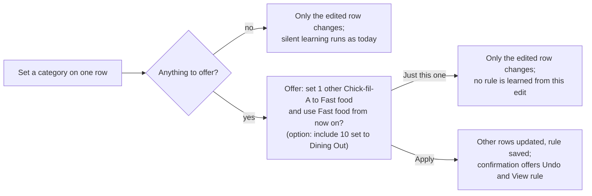

# PRD: Categorize a merchant everywhere at once

Status: reviewed draft, ready for UX design · 2026-09-27 · review record in
[reviews.md](reviews.md)

## Summary

When someone categorizes a transaction, Actual should offer to give the same
category to that merchant's other uncategorized transactions and to its future
ones, in one step the person approves.

Today, categorizing one Chick-fil-A purchase as Fast food changes that one
row. The other uncategorized Chick-fil-A purchases stay uncategorized, and
Actual only learns the merchant after the same category shows up on 3 of its 5
newest transactions. It learns silently, and only for purchases that arrive
later. People working through a backlog after their first import fix the same
merchant again and again.

The change is a short offer that appears after a category edit: "Also set 1
other Chick-fil-A transaction to Fast food, and use Fast food for Chick-fil-A
from now on?" Accepting updates those transactions and saves a rule the person
can see and edit on the Rules page. Declining changes nothing else.
Transactions that already have a different category are left alone unless the
person explicitly includes them.

## How it works today

Actual already learns merchant categories, but slowly, silently, and only for
the future. The logic is `updateCategoryRules` in
`packages/loot-core/src/server/transactions/transaction-rules.ts`. It runs
after a category edit in the desktop transaction table while the "learn
categories" setting is on, which is the default. Bulk edits from the selection
menu and edits on mobile do not trigger it.

- **When it learns.** After an edit, Actual reads that payee's 5 newest
  transactions, uncategorized ones included. If one category appears on at
  least 3 of them, it creates or updates a rule "payee is X, set category Y".
  It does nothing unless the edited transaction is one of those 5.
- **What the rule does.** Rules run on transactions as they are added or
  imported, or when someone selects transactions and chooses Run Rules.
  Nothing applies them to existing transactions on its own.
- **What the person sees.** Nothing. No message says a rule was created, and
  in the default sidebar the Rules page sits under More.
- **The manual route.** Select the transactions and choose Create rule. The
  editor pre-fills the raw bank description and an approximate amount, so the
  person must remove the amount condition before the rule covers every
  purchase. Apply actions in the same editor then updates the matches. It
  works, but few people find it and fewer adjust the conditions.

In the family sample budget (`yarn seed --profile family`, default options,
end date 2026-09-27), Chick-fil-A has 12 purchases: 10 marked Dining Out and 2
uncategorized, both in April. Setting the April 17 purchase to Fast food
updates that row only. The April 4 purchase stays uncategorized, and nothing
is learned, because April 17 is not among the 5 newest. To teach Actual Fast
food, the person would have to change 3 of the June to August purchases, and
the April 4 purchase would still be uncategorized.

## Goals and non-goals

Goals:

- One decision per merchant: categorizing a merchant once can settle its
  uncategorized backlog and its future transactions.
- The person approves every change beyond the row they edited, and can undo
  it.
- What Actual remembers is visible: the saved rule appears on the Rules page
  and can be edited or deleted there.
- A category the person already chose is never overwritten without an
  explicit choice.

Non-goals for this change:

- Suggesting categories for merchants the person has not categorized yet. That
  is where a learned model or a language model could help later, and this
  change is the baseline such a feature would be measured against.
- Removing the existing silent learning. It keeps running for every edit that
  does not show an offer.
- Rules with conditions beyond the payee, such as the account or the amount.
  See the mixed-use merchant scenario and the open questions.
- Mobile. The offer ships on desktop first, where the silent learning also
  lives today.

## Users and scenarios

**New user clearing a first import.** They imported three months of bank
history and face hundreds of uncategorized rows, many from the same few
merchants. Today each merchant takes several edits and teaches Actual nothing
until the third. With the offer, categorizing the first Trader Joe's purchase
settles every Trader Joe's row and every future one.

**Established user meeting a new merchant.** A new coffee shop appears in this
week's import. The first purchase shows no offer, because a one-off merchant
is not worth an interruption. When the second purchase arrives and they
categorize it, the offer saves the rule: two edits sooner than today.

**Mixed-use merchant.** A freelancer buys coffee at Starbucks on a personal
card (Coffee) and on a business card (Business Meals). A rule keyed on the
payee alone files every future Starbucks purchase under whichever category was
chosen last. The offer must not make this worse: it should say plainly what
the rule will do, so the person can decline. Handling it properly, with a rule
that also checks the account, is an open question.

**Correcting an earlier choice.** Someone decides Chick-fil-A belongs in Fast
food, not Dining Out. They want the old rows changed too, but only because
they asked. Including already-categorized rows is a separate, explicit option.

## Proposed experience

The offer appears only when accepting it would change something, and nothing
beyond the edited row changes until the person accepts.

1. The person sets a category on a transaction, in an account or in the
   uncategorized list. The edit saves immediately, as it does today.
2. Actual checks the payee. It shows an offer when the payee has at least one
   other transaction and either some of them are uncategorized or no rule
   already sets the payee to this category. Otherwise nothing is shown and the
   silent learning runs as it does today.
3. When an offer is shown, the silent learning does not run for that edit.
   The offer replaces it, so declining never leaves a rule behind.
4. The offer names the payee, the category and the count: "Also set 1 other
   Chick-fil-A transaction to Fast food, and use Fast food for Chick-fil-A
   from now on?" It has two actions, Apply and Just this one.
5. When the payee's other categorized transactions all share one different
   category, a secondary option shows that count: "Include 10 marked Dining
   Out." It is off unless the person turns it on.
6. When a simple rule already sets the payee to a different category, the
   offer says the rule will change: "This replaces the rule that sets
   Chick-fil-A to Dining Out."
7. Apply updates the transactions and saves the rule as one change. A
   confirmation says what happened and offers Undo and View rule.
8. Just this one, closing the offer, or ignoring it changes nothing more.

Actual's notifications hold one button and inline links, with no checkbox, so
this offer needs either a richer notification or a small surface of its own.
That choice belongs to the UX pass.

## Alternatives considered

| Option                                                               | Fixes the backlog | Remembers     | Person in control | Cost                                         |
| -------------------------------------------------------------------- | ----------------- | ------------- | ----------------- | -------------------------------------------- |
| Do nothing; point people to Create rule, Apply actions and Run Rules | Yes, manually     | Yes           | Yes               | None, but few people find it                 |
| Lower the silent-learning threshold from 3 to 1                      | No                | Yes, silently | No                | Very small                                   |
| Announce the silent learner's rules, with "apply to uncategorized"   | After 3 edits     | Yes, visibly  | Mostly            | Small                                        |
| Apply to all matching rows and save the rule automatically           | Yes               | Yes, silently | No                | Small                                        |
| Offer after the edit (proposed)                                      | Yes               | Yes, visibly  | Yes               | Small to medium                              |
| Suggest categories with a model                                      | Partly            | Depends       | Depends           | Large; needs a model, data leaves the device |

Lowering the threshold is the cheapest change, but it keeps learning
invisible, still never touches existing rows, and lets one careless edit
rewrite a merchant's future. Lunch Money ships this pattern (a silent
exact-match rule on every category change), and YNAB silently remembers each
payee's latest category. Applying automatically fixes the backlog fastest but
changes rows the person never looked at, the wrong trade in a finance app
where people reconcile against statements. Announcing the silent learner's
rules removes the silence at the lowest cost, but it keeps the three-edit
threshold, so it only partly helps a new user with a large import; it is the
fallback if the offer proves too noisy. A model-based suggestion solves a
different problem, merchants never categorized, and is deferred until this
baseline exists to compare it with.

The offer wins because it keeps each decision in the person's hands while
turning one edit into a complete one: backlog, future, and a rule they can
see. The closest precedents are Monarch, which shows a rule prompt after an
edit and makes applying it to past transactions an opt-in with a preview, and
Copilot, which asks after a recategorization whether to apply the change to
other transactions with the same name.

Sources: [YNAB](https://support.ynab.com/en_us/categorizing-transactions-a-guide-HyRl60sks),
Monarch help center article 360048393372 (Quick rules),
[Copilot](https://help.copilot.money/en/articles/3971270-creating-name-rules),
[Lunch Money](https://support.lunchmoney.app/setup/rules). Checked
2026-09-27.

## Requirements

1. After a single transaction's category is changed to a non-empty category
   in the desktop transaction table, Actual shows an offer when the payee has
   at least one other transaction and either some of them are uncategorized or
   no simple rule already sets the payee to that category.
2. When an offer is shown, the silent learner does not run for that edit. The
   only rule change comes from Apply.
3. The offer names the payee, the category, and the number of other
   uncategorized transactions it would change. With none to change, it offers
   only to remember the category for future transactions.
4. When all of the payee's other categorized transactions share one category
   different from the new one, the offer shows an unselected option with that
   count to include them. With more than one other category, the option is not
   shown; the rule editor's Apply actions covers that case.
5. A simple rule is exactly the shape the silent learner creates and updates:
   no stage, one condition "payee is X", one action setting the category. When
   a simple rule sets the payee to a different category, the offer states
   that it will replace it. Rules with more conditions, or with "is not", are
   never modified.
6. Apply changes the counted transactions and creates or updates the simple
   rule in one undoable step.
7. After Apply, a confirmation states the number of transactions changed and
   links to the rule. Its Undo reverts the Apply step only: the edited row
   keeps its new category, and the other transactions and the rule return to
   their previous state. Undo is offered only while Apply is the most recent
   change.
8. Declining, closing, or ignoring the offer leaves everything but the edited
   row unchanged.
9. The offer respects the existing controls: nothing is offered when the
   "learn categories" setting is off, or when learning is turned off for that
   payee.
10. Only one offer is shown at a time. Editing another transaction replaces
    the open offer with a new one or dismisses it.

## Edge cases

- **Rules with more conditions.** A rule that checks the payee and something
  else, such as the amount or the raw bank description, is not modified. The
  offer creates a separate simple rule. The more specific rule still decides
  the category for the transactions it matches, and the offer says so when one
  exists.
- **Split transactions.** Each split child has its own payee, copied from the
  parent when the child is created. Matching uses the child's own payee. Split
  parents are never counted or changed.
- **Transfers.** Payees that stand for an account never trigger an offer, even
  for an on-budget to off-budget transfer, which keeps a category.
- **Off-budget and closed accounts.** Excluded. Off-budget transactions carry
  no category, and the existing learning already ignores closed accounts.
- **Clearing a category.** Setting a transaction back to uncategorized shows
  no offer.
- **Bulk edits and mobile.** No offer, matching today, where neither triggers
  the silent learning.
- **No payee.** Transactions without a payee show no offer.
- **Income categories.** Offered the same way; a paycheck payee is a common
  and useful case.
- **Large backlogs.** The count and the update must stay fast with thousands
  of transactions for one payee. The update runs as one batch.
- **Sync.** The changed transactions and the rule sync to other devices like
  any other edit; no new sync behavior is needed.

## How we will know it works

Actual collects no usage data, so the evidence comes from sample budgets and
from a few people using it.

- **Regression checks.** Automated tests on budgets from `yarn seed` confirm
  that each merchant's backlog clears with one accepted offer, that declining
  changes nothing beyond the edited row and learns no rule, that
  already-categorized rows change only when included, and that Undo restores
  the previous state exactly. These verify the implementation, not the value.
- **Rule accuracy.** How often the saved rules categorize future transactions
  correctly, scored against the generator's answer key. This needs a small
  generator change: generate the full period, write all but the last month
  into the budget, then import the held-back month through the API with rules
  running. The freelancer profile is expected to score lower because of
  mixed-use merchants, which makes the limit of payee-only rules visible.
- **People.** Whether a transient offer gets noticed mid-edit, and whether an
  accepted rule later surprises anyone, can only come from people. A short
  trial with a handful of testers, asked exactly those two questions,
  answers it.

## Open questions

- Should the rule also match on the account when the payee's history spans
  accounts with different categories, as in the freelancer's Starbucks case?
- Should "Just this one" suppress future offers for that payee, and if so,
  where would the person turn it back on?
- For large backlogs, should the offer let the person review the affected
  rows before applying, as Monarch and Lunch Money do?
- Should the offer match on the payee alone, or also on the raw bank
  description when payees have been merged or renamed?
- Where does the offer appear, and for how long? This is for the UX pass.
